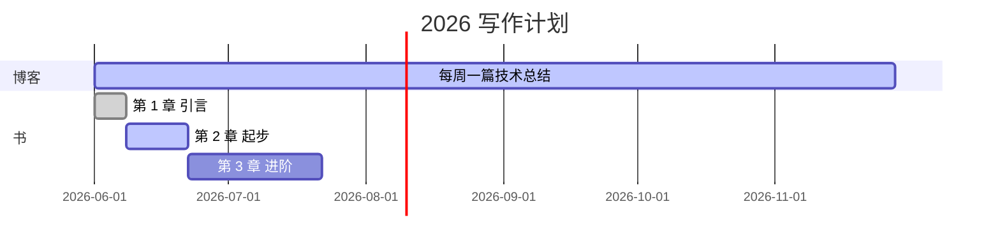

## 这个站点是怎么来的

经过半天折腾，今天把个人主页 `hello28256.github.io` 搭起来了。

**技术栈**：
- 主站（你正在看的）：[Chirpy](https://github.com/cotes2020/jekyll-theme-chirpy) (Jekyll)
- 书：[MkDocs Material](https://squidfunk.github.io/mkdocs-material/) 部署在 `/book/` 子路径

**这里会有什么内容**：
- 📝 技术博客（这一栏）
- 👤 [关于我](/about/)
- 💼 [作品集](/projects/)
- 📚 [我的书](/book/)

## 写作计划

## 关于这个主题

[Chirpy](https://chirpy.cotes.page/) 是我见过最适合技术博客的 Jekyll 主题：

- 深浅色一键切换
- 内置 TOC、归档、标签、分类
- 代码块、Mermaid、LaTeX 全支持
- 移动端体验也不错

> 第一次写 Jekyll 博客，如果有什么不对的地方，欢迎在 [GitHub Issues](https://github.com/hello28256/hello28256.github.io/issues) 提出。
{: .prompt-tip }
