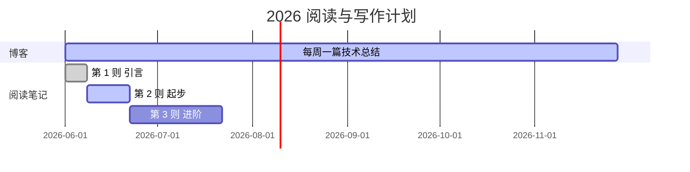

## 这个站点是怎么来的

经过半天折腾，今天把个人主页 `hello28256.github.io` 搭起来了。

**技术栈**：
- 主站（你正在看的）：[Minimal Mistakes](https://github.com/mmistakes/minimal-mistakes) (Jekyll) — aqua 皮肤
- 书：[VitePress](https://vitepress.dev/) 部署在 `/book/` 子路径

**这里会有什么内容**：
- 📝 技术博客（这一栏）
- 👤 [关于我](/about/)
- ⌨️ [Coding](https://hello28256.github.io/Coding/1001Coding/)
- 📚 [我的阅读](https://hello28256.github.io/book/)

## 阅读与写作计划

## 关于这个主题

[Minimal Mistakes](https://mmistakes.github.io/minimal-mistakes/) 是我见过的最灵活的双栏 Jekyll 主题：

- 内置 11 种皮肤（含 aqua、neon、mint 等）
- splash / single / archive / sidebar 四套布局
- 代码块、LaTeX 全支持
- 移动端体验不错

> 第一次写 Jekyll 博客，如果有什么不对的地方，欢迎在 [GitHub Issues](https://github.com/hello28256/hello28256.github.io/issues) 提出。
