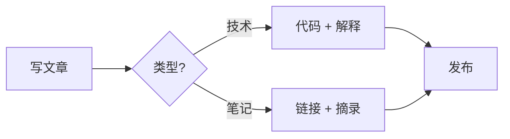

> 这是写新文章的模板文件。**复制 _config.yml 之外的 frontmatter 部分 + 正文骨架**到新文件，改文件名即可。

## 一级标题（H2）

### 二级标题（H3）

正文段落。多写几个段落试试节奏。MM 主题用 `Maxima` 字体，dark 皮肤下颜色 `#eaeaea`（近白）。

> 引用块：左边有青色竖条，背景略深。
> 
> ——适合放"注意"、"引文"、"自言自语"。

### 1. 代码块

```python
# Python 示例（高亮由 rouge 自动处理）
from typing import List

def hello(names: List[str]) -> None:
    for n in names:
        print(f"hello, {n}")

hello(["world", "human"])
```

```typescript
// TypeScript 示例
interface Todo { id: number; title: string; done: boolean }
const todos: Todo[] = [{ id: 1, title: "写一篇博客", done: false }]
```

### 2. 行内代码与强调

- 行内代码用反引号：`site.data.navigation.main`
- **粗体** 和 *斜体* 和 ***粗斜***
- ~~删除线~~ 和 ==标记==

### 3. 链接

- 站内链接：`[/about/](/about/)`
- 站内文章：`[welcome](/posts/2026/06/03/welcome/)`
- 外链：[Minimal Mistakes](https://github.com/mmistakes/minimal-mistakes) — 自动加 ↗ 小图标

### 4. 列表

无序：
- 第一项
- 第二项
  - 嵌套
  - 再嵌套

有序：
1. 第一步
2. 第二步
3. 第三步

任务列表：
- [ ] 待办事项
- [x] 已完成

### 5. Mermaid 图



### 6. LaTeX 行内与块

行内：勾股定理 $a^2 + b^2 = c^2$。

块：

$$
\int_{-\infty}^{\infty} e^{-x^2} \, dx = \sqrt{\pi}
$$

### 7. 表格

| 类别 | 例子 |
| --- | --- |
| 编程语言 | TypeScript / Python / Go |
| 数据库 | PostgreSQL / Redis |
| 工具链 | Docker / GitHub Actions |

### 8. 图片

```markdown

```

把图片文件放到 `assets/images/` 下，引用即可。MM dark 主题会自动给图片加一点圆角阴影。

### 9. 提示与折叠

> [!NOTE]
> 提示类（NOTE）：MM 不内置 admonition，要用这类需要装 jekyll admonitions 插件或自己写 include。

<details markdown="1">
  <summary>点击展开更多</summary>

  这是折叠内容。MM 默认不开启 `<details>` 高亮，但你 `<summary>` 会被识别。

</details>

### 10. 表情

:rocket: :coffee: :sparkles:

---

## 收尾

写完后的步骤：

1. 把这个文件 `cp _posts/2026-07-06-post-template.md _posts/$(date +%Y-%m-%d)-your-title.md`
2. 改 frontmatter 的 `title` / `date` / `categories` / `tags`
3. 正文替换为你的真实内容
4. `git add && git commit && git push`
5. 等 1–2 分钟 GH Pages 部署完成，刷 `https://hello28256.github.io/`

> ⚠️ 别把 "date" 写成未来时间，否则 jekyll 会在 publish-on 模式下不渲染。直接删这个模板的"date"。
